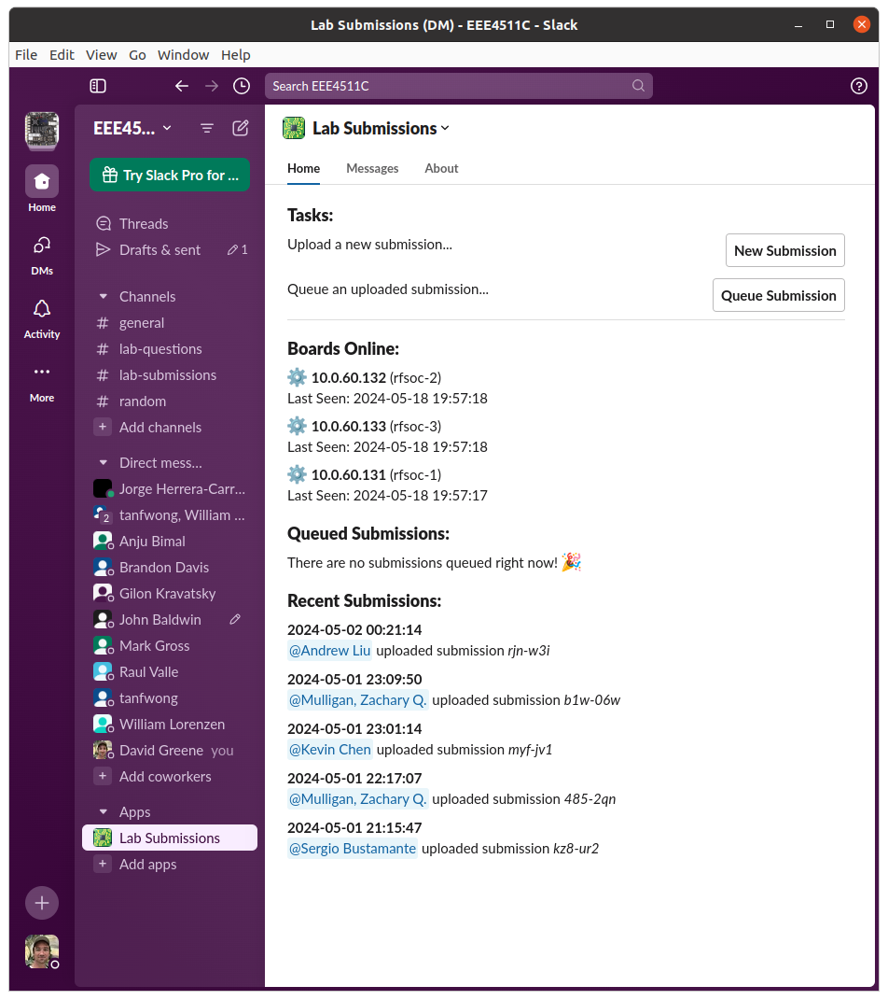
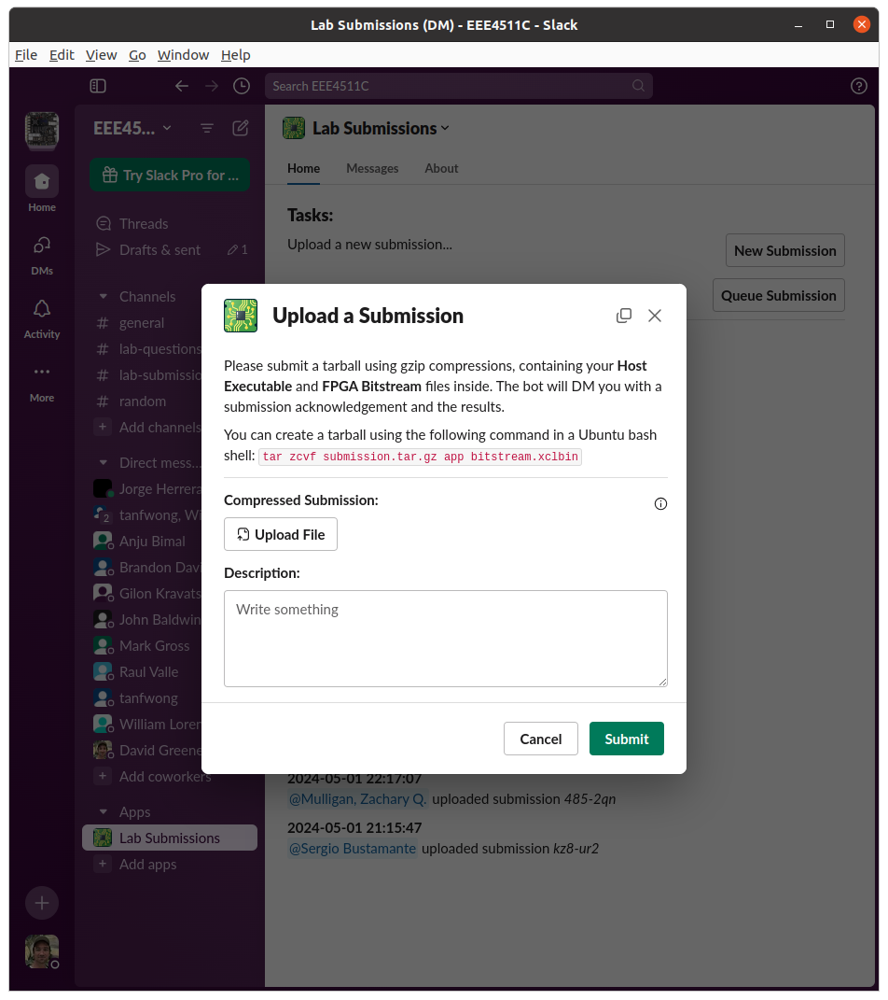
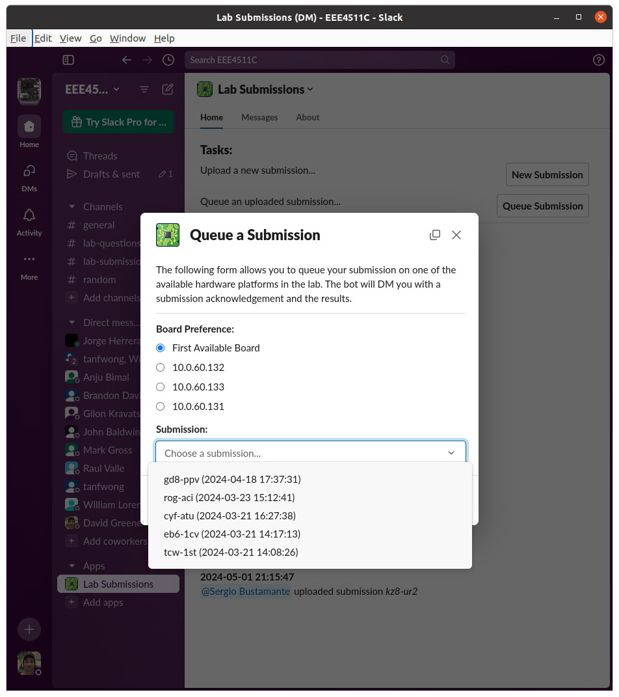

# Slack-Lab-Submission-Manager
Handles uploading, scheduling, monitoring, and reporting of lab submissions.

This Python 3 app can be run on its own by calling `python3 lsm.py` from the terminal. It uses nmap to scan the address range `10.0.60.0/24` for hosts with port 22 open and host names begining with "rfsoc". Before starting the app, you'll need to make sure you create a `.keys` folder in the working directory and add an OpenSSH private key that can be used to connect to the nodes.

Note: This needs a bot and app token from Slack with appropriate persmissions. I need to populate all that here.

To Do:
 - File uploads will be changing, so this will need some rework.
 - Add a way to cancel and delete jobs

Screenshot:

